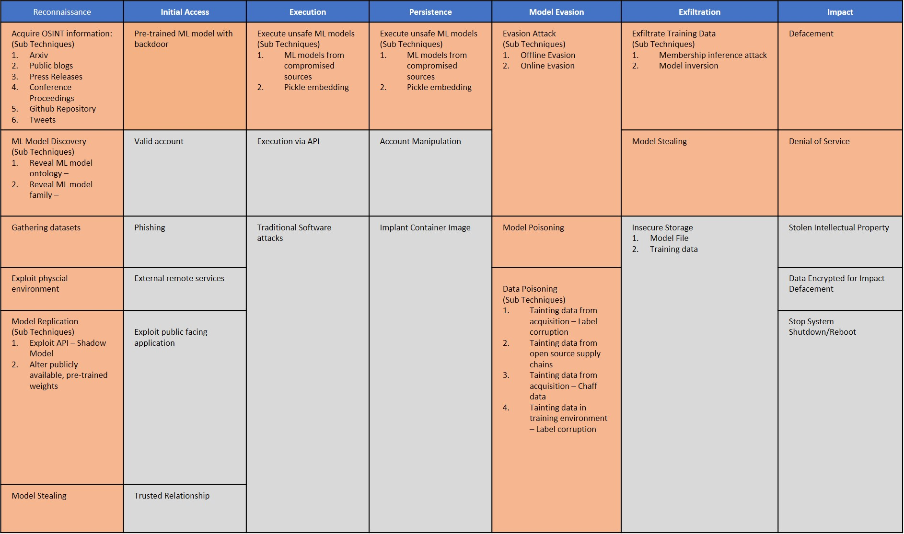

# Adversarial ML Threat Matrix - Table of Contents
1. [Adversarial ML 101](/pages/adversarial-ml-101.md#adversarial-machine-learning-101)
2. [Adversarial ML Threat Matrix](pages/adversarial-ml-threat-matrix.md#adversarial-ml-threat-matrix)
3. [Case Studies](/pages/case-studies-page.md#case-studies-page)
4. [Contributors](#contributors)
5. [Feedback and Getting Involved](#feedback-and-getting-involved)
    - [Join Our Mailing List](#join-our-mailing-list)
6. [Contact Us](#contact-us)
---- 

The goal of this project is to position attacks on machine learning (ML) systems in an [ATT&CK](https://attack.mitre.org/)-style framework so that security analysts can orient themselves
to these new and upcoming threats.

If you are new to how ML systems can be attacked, we suggest starting at this no-frills [Adversarial ML 101](/pages/adversarial-ml-101.md#adversarial-machine-learning-101) aimed at security analysts. 

Or if you want to dive right in, head to [Adversarial ML Threat Matrix](/pages/adversarial-ml-threat-matrix.md#adversarial-ml-threat-matrix).

## Why Develop an Adversarial ML Threat Matrix? 
-   In the last three years, major companies such as [Google](https://www.zdnet.com/article/googles-best-image-recognition-system-flummoxed-by-fakes/), [Amazon](https://www.fastcompany.com/90240975/alexa-can-be-hacked-by-chirping-birds), [Microsoft](https://www.theguardian.com/technology/2016/mar/24/tay-microsofts-ai-chatbot-gets-a-crash-course-in-racism-from-twitter), and [Tesla](https://spectrum.ieee.org/cars-that-think/transportation/self-driving/three-small-stickers-on-road-can-steer-tesla-autopilot-into-oncoming-lane), have had their ML systems tricked, evaded, or misled.
-   This trend is only set to rise: According to a [Gartner report](https://www.gartner.com/doc/3939991). 30% of cyberattacks by 2022 will involve data poisoning, model     theft or adversarial examples.
-   Industry is underprepared. In a [survey](https://arxiv.org/pdf/2002.05646.pdf) of 28 organizations spanning small as well as large organizations, 25           organizations did not know how to secure their ML systems.

Unlike traditional cybersecurity vulnerabilities that are tied to specific software and hardware systems, adversarial ML vulnerabilities are enabled by inherent limitations underlying ML algorithms. Data can be weaponized in new ways which requires an extension of how we model cyber adversary behavior, to reflect emerging threat vectors and the rapidly evolving adversarial machine learning attack lifecycle.

This threat matrix came out of partnership with 12 industry and academic research groups with the goal of empowering security analysts to orient themselves to these new and upcoming threats. **The framework is seeded with a curated set of vulnerabilities and adversary behaviors that Microsoft and MITRE have vetted to be effective against production ML systems**. We used ATT&CK as a template since security analysts are already familiar with using this type of matrix. 

We recommend digging into [Adversarial ML Threat Matrix](/pages/adversarial-ml-threat-matrix.md#adversarial-ml-threat-matrix). 

To see the Matrix in action, we recommend seeing the curated case studies

  - [ClearviewAI Misconfiguration](/pages/case-studies-page.md#clearviewai-misconfiguration)
  - [GPT-2 Model Replication](/pages/case-studies-page.md#gpt-2-model-replication)
  - [ProofPoint Evasion](/pages/case-studies-page.md#proofpoint-evasion)
  - [Tay Poisoning](/pages/case-studies-page.md#tay-poisoning)
  - [Microsoft - Azure Service - Evasion](/pages/case-studies-page.md#microsoft---azure-service)
  - [Microsoft Edge AI - Evasion](/pages/case-studies-page.md#microsoft---edge-ai)
  - [MITRE - Physical Adversarial Attack on Face Identification](/pages/case-studies-page.md#mitre---physical-adversarial-attack-on-face-identification)

## Contributors

| **Organization**    | **Contributors**    |
| :---                | :---                |
| Microsoft           | Ram Shankar Siva Kumar, Hyrum Anderson, Suzy Schapperle, Blake Strom, Madeline Carmichael, Matt Swann, Mark Russinovich, Nick Beede, Kathy Vu, Andi Comissioneru, Sharon Xia, Mario Goertzel, Jeffrey Snover, Derek Adam, Deepak Manohar, Bhairav Mehta, Peter Waxman, Abhishek Gupta, Ann Johnson, Andrew Paverd, Pete Bryan, Roberto Rodriguez  |
| MITRE               | Mikel Rodriguez, Christina Liaghati, Keith Manville, Michael Krumdick, Josh Harguess |
| Bosch               | Manojkumar Parmar |
| IBM                 | Pin-Yu Chen       |
| NVIDIA              | David Reber Jr., Keith Kozo, Christopher Cottrell, Daniel Rohrer |
| Airbus              | Adam Wedgbury     |
|PricewaterhouseCoopers |Michael Montecillo|
| Deep Instinct       | Nadav Maman, Shimon Noam Oren, Ishai Rosenberg|
| Two Six Labs        | David Slater      |
| University of Toronto | Adelin Travers, Jonas Guan, Nicolas Papernot |
| Cardiff University  | Pete Burnap |
| Software Engineering Institute/Carnegie Mellon University | Nathan M. VanHoudnos | 
| Berryville Institute of Machine Learning | Gary McGraw, Harold Figueroa, Victor Shepardson, Richie Bonett|

## Feedback and Getting Involved 

The Adversarial ML Threat Matrix is a first-cut attempt at collating a knowledge base of how ML systems can be attacked. We need your help to make it holistic and fill in the missing gaps!

### Corrections and Improvement

-   For immediate corrections, please submit a Pull Request with suggested changes! We are excited to make this system better with you!
-   For a more hands on feedback session, we are partnering with Defcon's AI Village to open up the framework to all community members to get feedback and make it better. Current thinking is to have this workshop circa
Jan/Feb 2021. Please register [here](https://docs.google.com/forms/d/e/1FAIpQLSdqtuE0v7qBRsGUUWDrzUEenHCdv-HNP1IiLil67dgpXtHqQw/viewform).

### Contribute Case Studies

We are especially excited for new case-studies! We look forward to contributions from both industry and academic researchers. Before submitting a case-study, consider that the attack:
1.  Exploits one or more vulnerabilities that compromises the confidentiality, integrity or availability of ML system. 
2.  The attack was against a *production, commercial* ML system. This can be on MLaaS like Amazon, Microsoft Azure, Google Cloud AI, IBM Watson etc or ML systems embedded in client/edge. 
3.  You have permission to share the information/published this research. Please follow the proper channels before reporting a new attack and make sure you are practicing responsible disclosure.

You can email advmlthreatmatrix-core@googlegroups.com with summary of the incident and Adversarial ML Threat Matrix mapping.

### Join our Mailing List

- For discussions around Adversarial ML Threat Matrix, we invite everyone to join our Google Group [here](https://groups.google.com/forum/#!forum/advmlthreatmatrix/join).
  - Note: Google Groups generally defaults to your personal email. If you would rather access this forum using your corporate email (as opposed to your gmail), you can create a Google account using your corporate email before joining the group.
  - Also most email clients route emails from Google Groups into "Other"/"Spam"/"Forums" folder. So, you may want to create a rule in your email client to have these emails go  into your inbox instead. 

 
 ## Contact Us
For corrections and improvement or to contribute a case study, see [Feedback](#feedback-and-getting-involved).

-  For general questions/comments/discussion, our public email group is advmlthreatmatrix-core@googlegroups.com. This emails all the members of the distribution group. 

-  For private comments/discussions and how organizations can get involved in the effort, please email: <Ram.Shankar@microsoft.com> and <Mikel@mitre.org>. 

